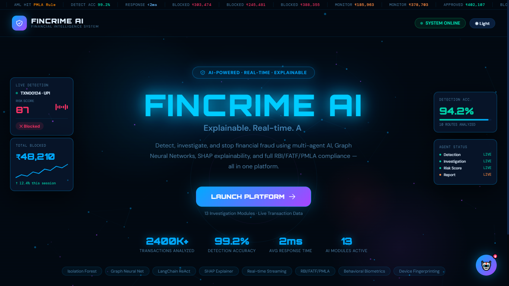
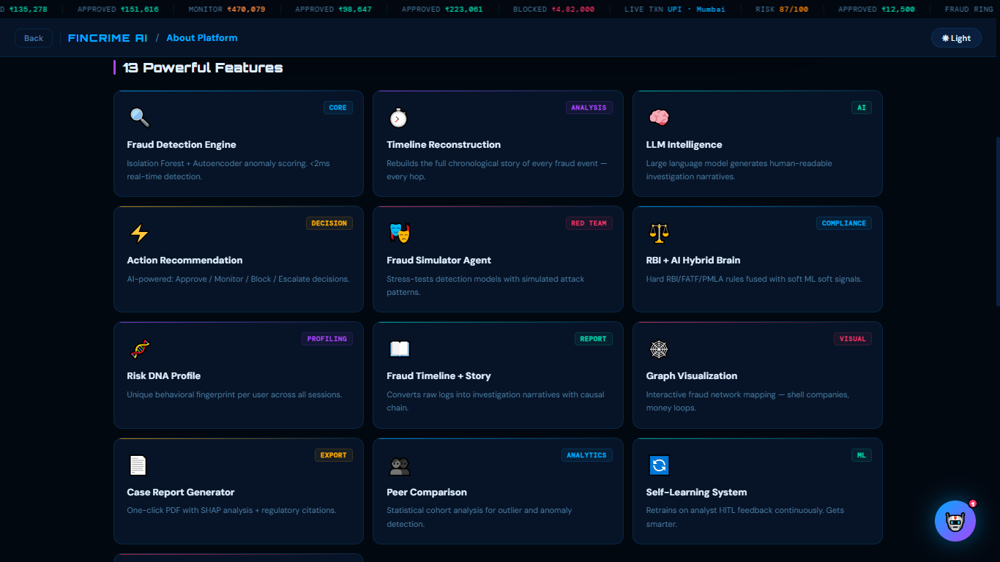
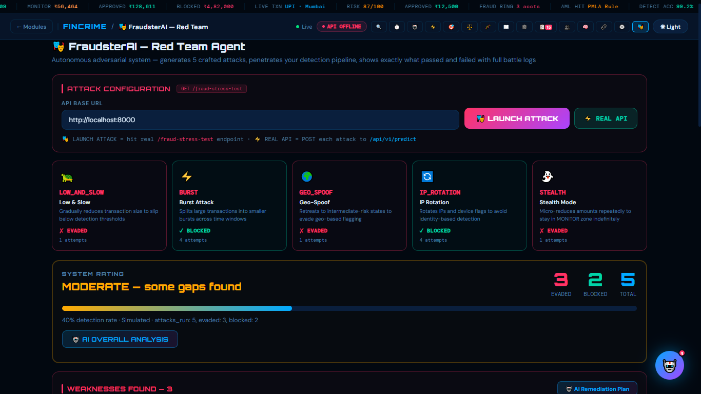
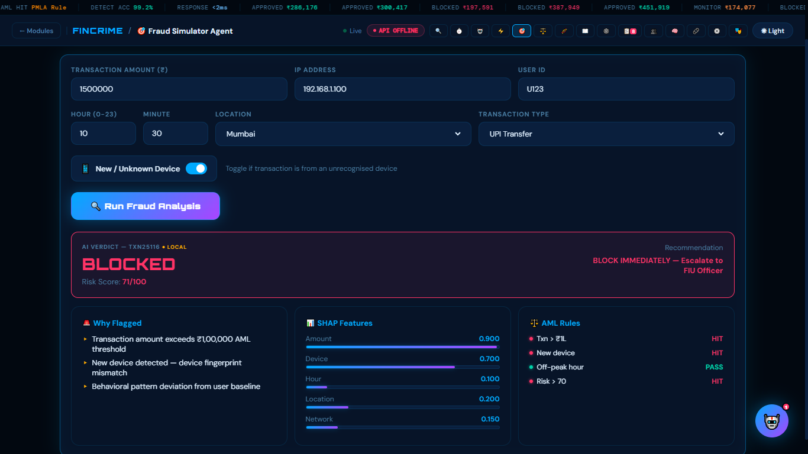
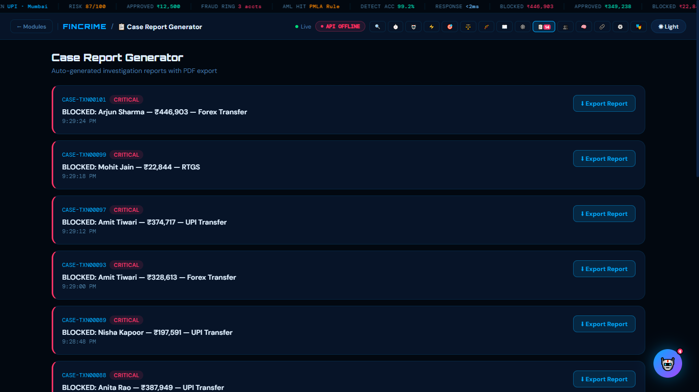

# 🚨 FinCrime AI – Intelligent Financial Fraud Detection System

## 📌 Overview

FinCrime AI is an advanced fraud detection system designed to identify suspicious financial transactions using a combination of machine learning models, rule-based analysis, and contextual intelligence.

The system analyzes transaction patterns, assigns risk scores, and helps detect fraud, money laundering, and abnormal financial behavior in real time.

---

## 🎯 Problem Statement

Financial fraud and money laundering are major challenges in the banking and fintech industry. Traditional systems often fail to detect complex fraud patterns in real time.

---

## 💡 Solution

FinCrime AI provides:

* Automated fraud detection using ML models
* Rule-based anomaly detection
* Intelligent risk scoring system
* Context-aware transaction analysis

---

## 🚀 Key Features

* 🔍 Fraud detection using trained ML model
* ⚙️ Rule-based fraud detection engine
* 📊 Risk scoring for transactions
* 🧠 Context-aware analysis
* 🧪 Model testing and evaluation
* 🌐 Simple frontend interface

---
## 📸 Screenshots

Below are some visuals of the FinCrime AI system in action:

### Landing Page


### Features Dashboard


### Fraudster AI


### Fraud Simulator


### Report Generator


---
## 🛠 Tech Stack

* **Backend:** Python
* **Machine Learning:** Scikit-learn
* **Frontend:** HTML/CSS
* **Data Processing:** Pandas, NumPy
* **Model Storage:** Pickle (.pkl files)

---

## 📂 Project Structure

```
backend/
  ├── app/
  │   ├── models/
  │   ├── services/
  │   └── main.py
  ├── train_model.py
  └── requirements.txt

frontend/
  └── index.html
```

---

## ⚙️ How to Run the Project

### 1️⃣ Clone Repository

```
git clone https://github.com/Navdeep223/Fincrime_ai.git
cd Fincrime_ai
```

### 2️⃣ Install Dependencies

```
pip install -r backend/requirements.txt
```

### 3️⃣ Run Backend

```
python backend/app/main.py
```

### 4️⃣ Open Frontend

Open:

```
frontend/index.html
```

---

## 📊 How It Works

1. Input transaction data
2. Preprocessing & feature extraction
3. ML model prediction
4. Rule-based validation
5. Risk score generation
6. Final fraud detection output

---

## 🔮 Future Improvements

* Real-time streaming data integration
* Deep learning-based fraud detection
* Dashboard with analytics
* API deployment (Flask/FastAPI)
* Integration with banking systems

---

## 👨‍💻 Contributors

* **Navdeep Sharma** – Developer
* **Pranav** – Developer

---

## 📌 Note

This project was developed as part of a hackathon to explore AI-based solutions for financial crime detection.

---

## ⭐ Support

If you like this project, consider giving it a ⭐ on GitHub!
